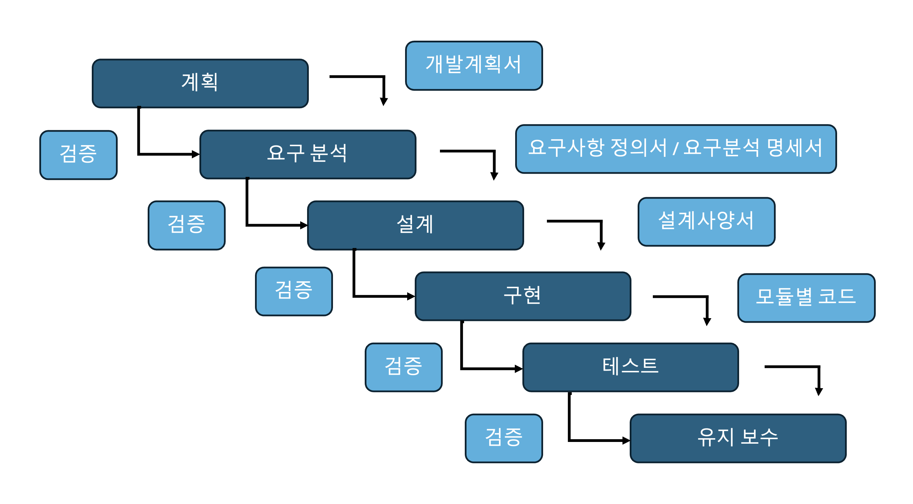
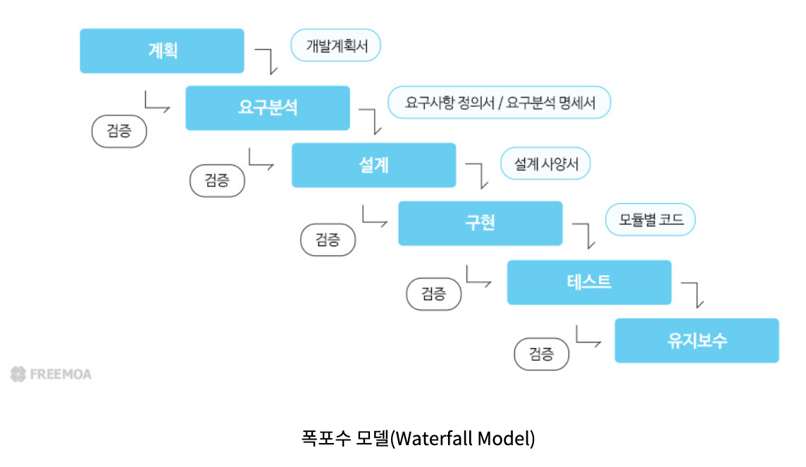
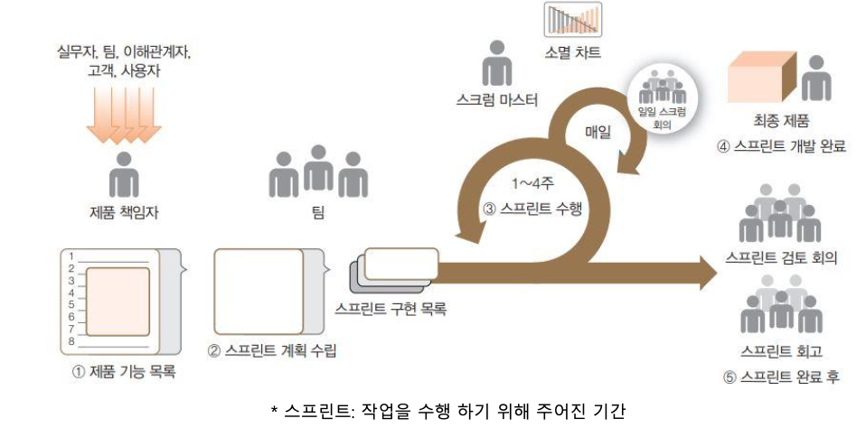
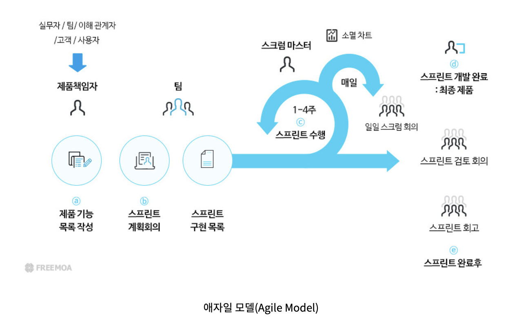
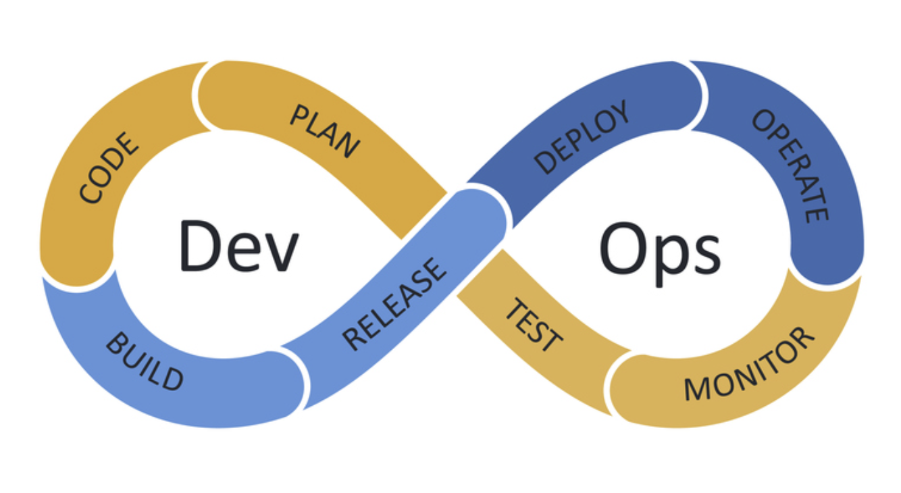
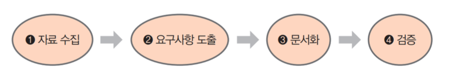
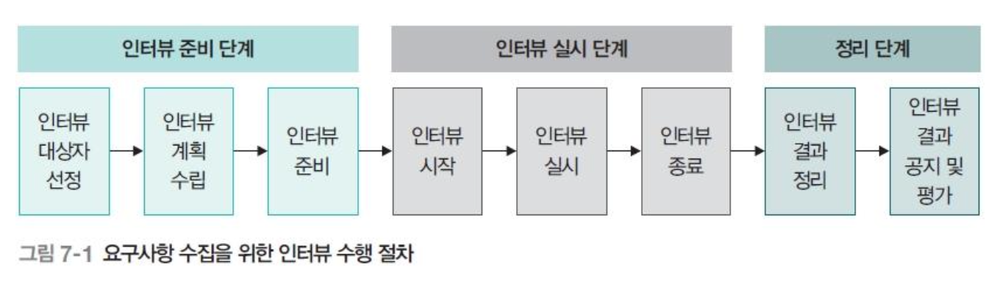
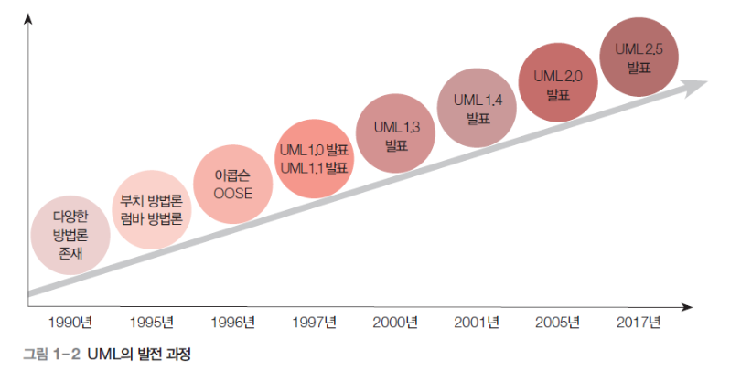
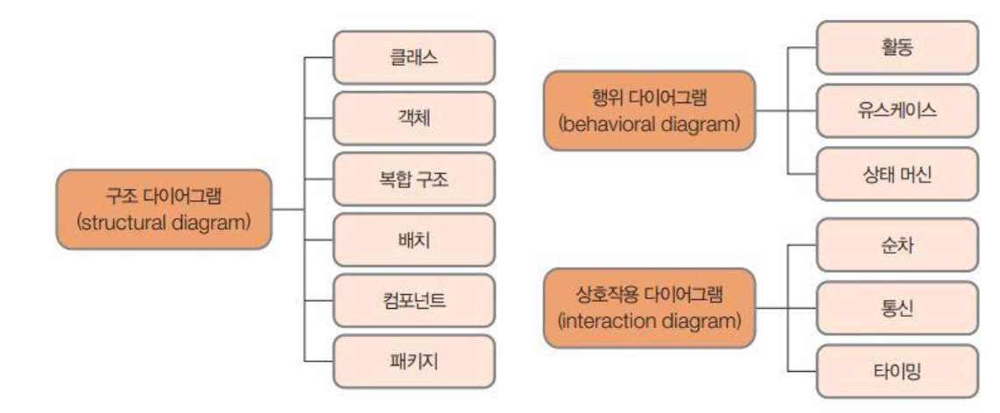

# SoftwareEngineerig

- 소프트웨어 공학 개요
    - 소프트웨어 공학의 정의와 목적
        - 소프트웨어 공학은 고품질의 소프트웨어를 효율적으로 개발하고 유지보수하기 위한 학문적, 실용적 접근 방법
        - 소프트웨어 공학의 목표는 시스템 개발의 효율성, 신뢰성, 유지보수성을 향상시키는 것임
    - 소프트웨어의 특징과 복잡성
        - 소프트웨어는 비물질적이며, 확장 가능하고, 사용자 요구에 맞게 빠르게 변경될 수 있음
        - 복잡성은 시스템의 크기, 상호작용, 유지보수 요구 사항 등에서 비롯됨
    - 소프트웨어 개발의 중요성과 도전 과제
        - 소프트웨어는 거의 모든 산업에서 필수적인 요소가 되었음
        - 그러나 요구사항 변경, 일정 지연, 품질 보증 문제 등 개발 중 다양한 도전 과제들이 존재함
    - 소프트웨어 공학의 발전 과정
        - 소프트웨어 공학은 초기의 비공식적인 개발 방법론에서, 점차 표준화된 개발 방법론 및 도구를 활용하는 방향으로 발전해왔음
        - 초기 폭포수 모델에서, 애자일 개발 및 DevOps 방식으로 발전하고 있음
- 소프트웨어 개발 생명 주기(SDLC)
    - SDLC 모델의 개념
        - 소프트웨어 개발 생명 주기(SDLC)는 소프트웨어를 기획부터 설계, 구현, 테스트, 배포, 유지보수까지의 전 과정에 걸쳐 체계적인 접근 방식을 제공합니다.
    - 전통적 SDLC 모델
        - 폭포수 모델
            - 개발 프로세스가 순차적으로 진행되는 전통적인 모델입니다. 각 단계가 끝난 후에야 다음 단계로 넘어가므로 유연성이 부족함
            
            
            
        - V-모델
            - 폭포수 모델을 확장한 것으로, 각 개발 단계마다 대응되는 테스트 단계가 존재하여 개발과 테스트가 동시에 진행됨
            
            
            
    - 현대적 SDLC 모델
        
        
        
        
        
        - 애자일(Agile)
            - 빠르고 유연한 개발을 지향하며, 짧은 개발 주기를 통해 고객의 요구사항을 신속히 반영함
        - 스크럼(Scrum)
            - 애자일 방법론의 일종으로, 일정 기간인 스프린트(Sprint)를 통해 제품을 개발하고, 데일리 스탠드업 회의와 같은 절차로 진행됨
        - 칸반(Kanban)
            - 작업 항목을 시각적으로 관리하여 효율성을 높이는 방법론
    - DevOps와 CI/CD
        - 개발과 운영을 통합하여 빠른 소프트웨어 배포를 지향하며, 지속적인 통합(CI)과 지속적인 배포(CD)를 통해 소프트웨어의 품질을 유지함
    
    
    
- 요구사항 분석
    
    
    
    - 요구 사항의 정의와 중요성
        - 요구사항은 소프트웨어 시스템이 충족해야 할 기능과 성능 요구를 정의함
        - 요구사항 분석은 시스템의 성공적인 개발을 위해 필수
    - 기능 요구 사항과 비기능 요구 사항
        - **기능 요구 사항**: 소프트웨어가 수행해야 하는 특정 작업이나 기능에 대한 요구사항
        - **비기능 요구 사항**: 성능, 보안, 사용성 등 시스템이 어떻게 동작해야 하는지에 대한 요구사항
    - 요구 사항 수집 기법
        - 인터뷰: 사용자나 관련자와의 인터뷰를 통해 요구사항을 수집
        
        
        
        - 설문: 다양한 사람들의 의견을 수집할 수 있는 방법
        - 관찰: 사용자 작업을 직접 관찰하여 요구사항을 도출
        - 워크숍: 여러 사람들이 모여서 요구사항을 도출하는 협업 방식
    - 요구 사항 명세서 작성
        - 요구사항 명세서는 기능과 비기능 요구사항을 정리한 문서
        - 시스템 설계 및 개발의 기초가 됨
    - 요구 사항 검증 및 관리
        - 요구사항이 정확하고 일관되게 정의되었는지 검증하고, 변경 관리 프로세스를 통해 지속적으로 관리
- 소프트웨어 설계
    - 소프트웨어 설계의 원칙
        - 모듈화
            - 시스템을 독립적이고 재사용 가능한 모듈로 나눔
            - 각 모듈은 특정 기능을 수행하며, 다른 모듈과 최소한의 의존성을 가짐
            
            ```c
            // in C
            
            #include <stdio.h>
            
            // 독립된 모듈: 덧셈 기능
            int add(int a, int b) {
                return a + b;
            }
            
            // 독립된 모듈: 곱셈 기능
            int multiply(int a, int b) {
                return a * b;
            }
            
            int main() {
                printf("Sum: %d\n", add(3, 5));
                printf("Product: %d\n", multiply(3, 5));
                return 0;
            }
            ```
            
            ```python
            # in Python
            
            # 독립된 모듈: 덧셈 기능
            def add(a, b):
                return a + b
            
            # 독립된 모듈: 곱셈 기능
            def multiply(a, b):
                return a * b
            
            # 메인 모듈
            if __name__ == "__main__":
                print("Sum:", add(3, 5))
                print("Product:", multiply(3, 5))
            ```
            
        - 추상화
            - 불필요한 세부 사항을 숨기고, 중요한 개념만을 다룸
            - 인터페이스를 통해 내부 구현을 숨기고 기능만을 노출함
            
            ```java
            // in Java
            
            // 추상 클래스: 동물의 공통 동작 정의
            abstract class Animal {
                abstract void sound(); // 추상 메서드: 세부 구현 없음
                void sleep() { // 일반 메서드: 공통 동작 구현
                    System.out.println("Sleeping...");
                }
            }
            
            // 구체적인 클래스: 추상 메서드 구현
            class Dog extends Animal {
                @Override
                void sound() {
                    System.out.println("Woof! Woof!");
                }
            }
            
            class Cat extends Animal {
                @Override
                void sound() {
                    System.out.println("Meow! Meow!");
                }
            }
            
            public class Main {
                public static void main(String[] args) {
                    // 추상 클래스의 참조 변수로 객체 생성
                    Animal dog = new Dog();
                    Animal cat = new Cat();
                    
                    // 공통된 인터페이스 사용
                    dog.sound(); // Woof! Woof!
                    dog.sleep(); // Sleeping...
                    
                    cat.sound(); // Meow! Meow!
                    cat.sleep(); // Sleeping...
                }
            }
            
            /*
            추상 클래스 Animal
            
            sound 메서드는 추상 메서드로 선언되어 구체적인 구현은 하위 클래스에서 정의함
            sleep 메서드는 공통 동작으로 모든 동물이 사용할 수 있음
            구체적인 클래스 Dog와 Cat
            
            Animal의 추상 메서드 sound를 각각 구현하여 동물별 소리를 출력함
            메인 메서드
            
            Animal의 참조 변수를 사용하여 다형성을 구현
            구체적인 객체(Dog 또는 Cat)에 따라 다른 동작을 수행함
            */
            ```
            
            ```c
            // in C
            
            #include <stdio.h>
            
            // 추상화: 내부 구현 숨김
            int calculate(int (*operation)(int, int), int a, int b) {
                return operation(a, b);
            }
            
            int add(int a, int b) {
                return a + b;
            }
            
            int multiply(int a, int b) {
                return a * b;
            }
            
            int main() {
                printf("Sum: %d\n", calculate(add, 3, 5));
                printf("Product: %d\n", calculate(multiply, 3, 5));
                return 0;
            }
            
            ```
            
            ```python
            # in Python
            
            # 추상화: 내부 구현 숨김
            def calculate(operation, a, b):
                return operation(a, b)
            
            def add(a, b):
                return a + b
            
            def multiply(a, b):
                return a * b
            
            # 메인 코드
            if __name__ == "__main__":
                print("Sum:", calculate(add, 3, 5))
                print("Product:", calculate(multiply, 3, 5))
            
            ```
            
        - 캡슐화
            - 데이터와 데이터를 처리하는 메서드를 하나의 객체로 묶는 원칙
            - 외부에서 접근할 수 있는 인터페이스만 노출하며, 내부 데이터는 보호함
            
            ```c
            // in C
            
            #include <stdio.h>
            
            typedef struct {
                int value;
            } Encapsulated;
            
            // 캡슐화된 데이터와 연산
            void setValue(Encapsulated *obj, int val) {
                obj->value = val;
            }
            
            int getValue(Encapsulated *obj) {
                return obj->value;
            }
            
            int main() {
                Encapsulated obj;
                setValue(&obj, 42);
                printf("Value: %d\n", getValue(&obj));
                return 0;
            }
            ```
            
            ```python
            # in Python
            
            class Encapsulated:
                def __init__(self):
                    self.__value = 0  # 캡슐화된 데이터
            
                def set_value(self, val):
                    self.__value = val
            
                def get_value(self):
                    return self.__value
            
            # 메인 코드
            if __name__ == "__main__":
                obj = Encapsulated()
                obj.set_value(42)
                print("Value:", obj.get_value())
            
            ```
            
    - 아키텍처 설계
        - 계층형 아키텍처
            - 시스템을 여러 계층으로 나누어 각 계층이 다른 계층과 독립적으로 동작하도록 설계함
        - MVC
            - 사용자 인터페이스와 비즈니스 로직을 분리하여 유지보수성과 확장성을 높이는 설계 패턴임
        - 마이크로서비스
            - 시스템을 독립적인 서비스 단위로 분할하여 개발하는 방식
    - 설계 패턴
        - 생성 패턴
            - 객체 생성 방식에 관한 패턴 (예: 싱글턴, 팩토리)
        - 구조 패턴
            - 객체 간의 관계를 다루는 패턴 (예: 어댑터, 데코레이터)
        - 행위 패턴
            - 객체 간의 상호작용을 다루는 패턴 (예: 옵저버, 전략)
    - UML(Unified Modeling Language)
        
        
        
        
        
        - 클래스 다이어그램
            - 시스템의 클래스를 시각적으로 표현
        - 시퀀스 다이어그램
            - 객체 간의 상호작용을 시간 순으로 나타냄
        - 유스케이스 다이어그램
            - 사용자와 시스템 간의 상호작용을 나타냄
- 소프트웨어 구현
    - 프로그래밍 원칙과 관례
        - 소프트웨어 구현은 코드 품질과 유지보수성을 고려하여 설계 원칙과 프로그래밍 관례를 준수해야 함
    - 코드 품질 관리
        - 가독성: 코드는 명확하고 읽기 쉬워야 함
        
        ```c
        // in C
        
        #include <stdio.h>
        
        // 두 숫자의 합을 반환
        int calculateSum(int num1, int num2) {
            return num1 + num2;
        }
        
        int main() {
            int a = 10, b = 20;
            int sum = calculateSum(a, b);
            
            // 결과 출력
            printf("The sum of %d and %d is %d\n", a, b, sum);
            return 0;
        }
        
        ```
        
        ```python
        # in Python
        
        # 두 숫자의 합을 반환
        def calculate_sum(num1, num2):
            return num1 + num2
        
        # 메인 코드
        if __name__ == "__main__":
            a, b = 10, 20
            sum_result = calculate_sum(a, b)
            
            # 결과 출력
            print(f"The sum of {a} and {b} is {sum_result}")
        
        ```
        
        - 유지보수성: 코드는 변경 및 개선이 용이해야 함
        
        ```c
        // in C
        
        #include <stdio.h>
        
        // 덧셈 연산
        int add(int a, int b) {
            return a + b;
        }
        
        // 곱셈 연산
        int multiply(int a, int b) {
            return a * b;
        }
        
        int main() {
            int x = 5, y = 10;
            printf("Sum: %d\n", add(x, y));
            printf("Product: %d\n", multiply(x, y));
            return 0;
        }
        ```
        
        ```python
        # in Python
        
        # 덧셈 연산
        def add(a, b):
            return a + b
        
        # 곱셈 연산
        def multiply(a, b):
            return a * b
        
        if __name__ == "__main__":
            x, y = 5, 10
            print("Sum:", add(x, y))
            print("Product:", multiply(x, y))
        ```
        
        - 재사용성
            - 코드의 재사용 가능성을 높여야 함
            - 일반화된 함수, 라이브러리화를 통해 재사용성을 높일 수 있음
            
            ```c
            // in C
            
            #include <stdio.h>
            
            // 재사용 가능한 계산 함수
            int calculate(int a, int b, char operation) {
                switch (operation) {
                    case '+': return a + b;
                    case '-': return a - b;
                    case '*': return a * b;
                    case '/': return b != 0 ? a / b : 0;
                    default: return 0;
                }
            }
            
            int main() {
                printf("Addition: %d\n", calculate(10, 5, '+'));
                printf("Multiplication: %d\n", calculate(10, 5, '*'));
                return 0;
            }
            
            ```
            
            ```python
            # in Python
            
            # 재사용 가능한 계산 함수
            def calculate(a, b, operation):
                if operation == "+":
                    return a + b
                elif operation == "-":
                    return a - b
                elif operation == "*":
                    return a * b
                elif operation == "/":
                    return a / b if b != 0 else None
                else:
                    return None
            
            if __name__ == "__main__":
                print("Addition:", calculate(10, 5, "+"))
                print("Multiplication:", calculate(10, 5, "*"))
            
            ```
            
    - 버전 관리 시스템
        - Git과 GitHub: 버전 관리 시스템은 소스 코드 변경 이력을 관리하고, 협업을 원활하게 해주는 도구
    - 코드 리뷰와 협업 도구:
        - 코드 리뷰는 소프트웨어 품질을 높이는 중요한 활동임
        - 협업 도구는 팀 간 소통과 효율적인 작업을 지원함
- 소프트웨어 테스트
    - 소프트웨어 테스트의 필요성과 목적: 소프트웨어 테스트는 제품의 품질을 보장하고, 결함을 조기에 발견하여 수정하는 중요한 과정임
    - 테스트 수준
        - 단위 테스트: 개별 모듈이나 함수 단위로 기능을 검증함
        - 통합 테스트: 여러 모듈 간의 상호작용을 테스트
        - 시스템 테스트: 전체 시스템의 기능과 성능을 테스트
        - 인수 테스트: 사용자의 요구사항을 충족하는지 테스트
        
        ```c
        #include <CUnit/CUnit.h>
        #include <CUnit/Basic.h>
        
        int add(int a, int b) {
            return a + b;
        }
        
        void test_add() {
            CU_ASSERT_EQUAL(add(2, 3), 5);
            CU_ASSERT_EQUAL(add(-1, 1), 0);
        }
        
        int main() {
            CU_initialize_registry();
            CU_pSuite suite = CU_add_suite("Math Suite", 0, 0);
            CU_add_test(suite, "test of add()", test_add);
            CU_basic_run_tests();
            CU_cleanup_registry();
            return 0;
        }
        ```
        
    - 테스트 기법
        - 화이트박스 테스트: 코드의 내부 구조를 이해하고 테스트하는 방법
        - 블랙박스 테스트: 시스템의 기능만을 검증하는 테스트
    - 테스트 자동화 도구
        - Selenium
            - **정의**
                - 웹 애플리케이션을 자동으로 테스트할 수 있는 오픈소스 도구
                - 다양한 브라우저와 플랫폼에서 동작 가능
            - **특징**
                - 웹 기반 애플리케이션 테스트에 최적화
                - 여러 언어(Java, Python, C#, 등)를 지원함
                - 다양한 브라우저(Chrome, Firefox, Safari 등)와 호환
            - **동작 방식**
                1. 테스트 스크립트를 작성하여 브라우저를 제어함
                2. 브라우저에서 사용자 동작(클릭, 입력 등)을 자동화
                3. 결과를 확인하고 오류를 리포팅
            - **장단점**
                - **장점**: 다양한 언어와 브라우저 지원, 확장 가능성
                - **단점**: 설정 및 유지보수에 많은 시간이 필요함
            - **활용**
                
                웹사이트 기능 테스트
                
                크로스 브라우저 테스트
                
        - JUnit
            - **정의**
                - Java 기반 애플리케이션을 테스트하는 단위 테스트 프레임워크
                - 자바 개발자들에게 필수적인 도구
            - **특징**
                - 코드 단위(메서드, 클래스)를 테스트
                - 애너테이션 기반으로 테스트 코드 작성
                - 다른 테스트 도구와 쉽게 통합 가능 (예: Maven, Jenkins)
            - **동작 방식**
                1. @Test 애너테이션으로 테스트 메서드를 정의
                2. 테스트 실행 후 결과(성공/실패)를 리포팅
                3. 특정 조건(assertions)을 만족하는지 검증
            - **장단점**
                - **장점**: 간단하고 빠른 단위 테스트, Java와 완벽 호환
                - **단점**: 단위 테스트 외의 대규모 테스트에는 적합하지 않음
            - **활용**
                - 자바 애플리케이션의 기능 테스트
                - 단위 테스트 자동화
        - PyTest
            - **정의**
                - Python용 테스트 프레임워크로 간단하고 직관적인 API 제공
                - 단위 테스트, 기능 테스트 등 다양한 테스트 지원
            - **특징**
                - 단순한 구문으로 테스트 코드 작성 가능
                - 풍부한 플러그인 시스템 제공
                - 다른 테스트 프레임워크(unittest 등)와 호환 가능
            - **동작 방식**
                1. def 키워드로 테스트 함수 정의 (함수 이름은 test_로 시작)
                2. assert 문을 사용해 조건 검증
                3. 테스트 실행 결과를 리포팅
            - **장단점**
                - **장점**: 유연한 플러그인 시스템, 간결한 문법
                - **단점**: 매우 대규모 프로젝트에서 성능 저하 가능
            - **활용**
                - 파이썬 애플리케이션의 기능 및 단위 테스트
                - 데이터 처리 파이프라인 검증

- 소프트웨어 유지보수
    - 유지보수의 정의와 유형
        - 수정 유지보수, 적응 유지보수, 예방 유지보수
    - 유지보수 프로세스
    - 리팩토링과 코드 품질 개선
- 프로젝트 관리
    - 소프트웨어 프로젝트 관리 개념
    - 프로젝트 계획과 일정 관리
    - 자원 관리
        - 인력, 비용, 도구
    - 리스크 관리
    - 소프트웨어 품질 보증(SQA)
- 애자일 소프트웨어 개발
    - 애자일의 원칙과 가치
    - 스크럼 프레임워크
        - 스프린트, 백로그, 데일리 스탠드업
    - 칸반과 지속적 전달
    - XP(익스트림 프로그래밍)의 실천
- 소프트웨어 메트릭
    - 소프트웨어 메트릭의 개념
    - 코드 복잡도 측정
        - 사이클로매틱 복잡도
    - 생산성과 품질 메트릭
    - 메트릭 기반 프로젝트 관리
- 리스크 관리
    - 소프트웨어 개발에서의 리스크 정의
    - 리스크 식별과 평가
    - 리스크 완화 및 대응 전략
    - 리스크 관리 도구
- 소프트웨어 재사용과 컴포넌트 기반 개발
    - 소프트웨어 재사용의 개념과 이점
    - 라이브러리와 프레임워크 활용
    - 컴포넌트 기반 개발(CBD)
    - API 설계와 통합
- 소프트웨어 보안
    - 보안 위협과 취약점
    - 안전한 소프트웨어 개발 원칙
    - 보안 테스트와 취약점 분석
    - 보안 관리와 데이터 보호
