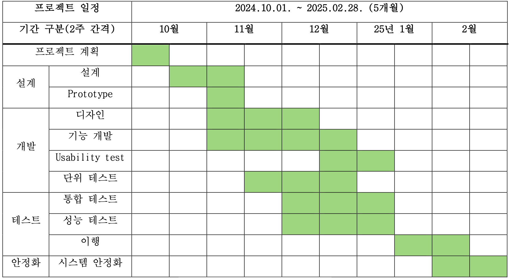

# SoftwareEngineerig

- 소프트웨어 공학 개요
    - 소프트웨어 공학의 정의와 목적
        - 소프트웨어 공학은 고품질의 소프트웨어를 효율적으로 개발하고 유지보수하기 위한 학문적, 실용적 접근 방법
        - 소프트웨어 공학의 목표는 시스템 개발의 효율성, 신뢰성, 유지보수성을 향상시키는 것임
    - 소프트웨어의 특징과 복잡성
        - 소프트웨어는 비물질적이며, 확장 가능하고, 사용자 요구에 맞게 빠르게 변경될 수 있음
        - 복잡성은 시스템의 크기, 상호작용, 유지보수 요구 사항 등에서 비롯됨
    - 소프트웨어 개발의 중요성과 도전 과제
        - 소프트웨어는 거의 모든 산업에서 필수적인 요소가 되었음
        - 그러나 요구사항 변경, 일정 지연, 품질 보증 문제 등 개발 중 다양한 도전 과제들이 존재함
    - 소프트웨어 공학의 발전 과정
        - 소프트웨어 공학은 초기의 비공식적인 개발 방법론에서, 점차 표준화된 개발 방법론 및 도구를 활용하는 방향으로 발전해왔음
        - 초기 폭포수 모델에서, 애자일 개발 및 DevOps 방식으로 발전하고 있음
- 소프트웨어 개발 생명 주기(SDLC)
    - SDLC 모델의 개념
        - 소프트웨어 개발 생명 주기(SDLC)는 소프트웨어를 기획부터 설계, 구현, 테스트, 배포, 유지보수까지의 전 과정에 걸쳐 체계적인 접근 방식을 제공합니다.
    - 전통적 SDLC 모델
        - 폭포수 모델
            - 개발 프로세스가 순차적으로 진행되는 전통적인 모델입니다. 각 단계가 끝난 후에야 다음 단계로 넘어가므로 유연성이 부족함
            
            
            
        - V-모델
            - 폭포수 모델을 확장한 것으로, 각 개발 단계마다 대응되는 테스트 단계가 존재하여 개발과 테스트가 동시에 진행됨
            
            
            
    - 현대적 SDLC 모델
        
        
        
        
        
        - 애자일(Agile)
            - 빠르고 유연한 개발을 지향하며, 짧은 개발 주기를 통해 고객의 요구사항을 신속히 반영함
        - 스크럼(Scrum)
            - 애자일 방법론의 일종으로, 일정 기간인 스프린트(Sprint)를 통해 제품을 개발하고, 데일리 스탠드업 회의와 같은 절차로 진행됨
        - 칸반(Kanban)
            - 작업 항목을 시각적으로 관리하여 효율성을 높이는 방법론
    - DevOps와 CI/CD
        - 개발과 운영을 통합하여 빠른 소프트웨어 배포를 지향하며, 지속적인 통합(CI)과 지속적인 배포(CD)를 통해 소프트웨어의 품질을 유지함
    
    
    
- 요구사항 분석
    
    
    
    - 요구 사항의 정의와 중요성
        - 요구사항은 소프트웨어 시스템이 충족해야 할 기능과 성능 요구를 정의함
        - 요구사항 분석은 시스템의 성공적인 개발을 위해 필수
    - 기능 요구 사항과 비기능 요구 사항
        - **기능 요구 사항**: 소프트웨어가 수행해야 하는 특정 작업이나 기능에 대한 요구사항
        - **비기능 요구 사항**: 성능, 보안, 사용성 등 시스템이 어떻게 동작해야 하는지에 대한 요구사항
    - 요구 사항 수집 기법
        - 인터뷰: 사용자나 관련자와의 인터뷰를 통해 요구사항을 수집
        
        
        
        - 설문: 다양한 사람들의 의견을 수집할 수 있는 방법
        - 관찰: 사용자 작업을 직접 관찰하여 요구사항을 도출
        - 워크숍: 여러 사람들이 모여서 요구사항을 도출하는 협업 방식
    - 요구 사항 명세서 작성
        - 요구사항 명세서는 기능과 비기능 요구사항을 정리한 문서
        - 시스템 설계 및 개발의 기초가 됨
    - 요구 사항 검증 및 관리
        - 요구사항이 정확하고 일관되게 정의되었는지 검증하고, 변경 관리 프로세스를 통해 지속적으로 관리
- 소프트웨어 설계
    - 소프트웨어 설계의 원칙
        - 모듈화
            - 시스템을 독립적이고 재사용 가능한 모듈로 나눔
            - 각 모듈은 특정 기능을 수행하며, 다른 모듈과 최소한의 의존성을 가짐
            
            ```c
            // in C
            
            #include <stdio.h>
            
            // 독립된 모듈: 덧셈 기능
            int add(int a, int b) {
                return a + b;
            }
            
            // 독립된 모듈: 곱셈 기능
            int multiply(int a, int b) {
                return a * b;
            }
            
            int main() {
                printf("Sum: %d\n", add(3, 5));
                printf("Product: %d\n", multiply(3, 5));
                return 0;
            }
            ```
            
            ```python
            # in Python
            
            # 독립된 모듈: 덧셈 기능
            def add(a, b):
                return a + b
            
            # 독립된 모듈: 곱셈 기능
            def multiply(a, b):
                return a * b
            
            # 메인 모듈
            if __name__ == "__main__":
                print("Sum:", add(3, 5))
                print("Product:", multiply(3, 5))
            ```
            
        - 추상화
            - 불필요한 세부 사항을 숨기고, 중요한 개념만을 다룸
            - 인터페이스를 통해 내부 구현을 숨기고 기능만을 노출함
            
            ```java
            // in Java
            
            // 추상 클래스: 동물의 공통 동작 정의
            abstract class Animal {
                abstract void sound(); // 추상 메서드: 세부 구현 없음
                void sleep() { // 일반 메서드: 공통 동작 구현
                    System.out.println("Sleeping...");
                }
            }
            
            // 구체적인 클래스: 추상 메서드 구현
            class Dog extends Animal {
                @Override
                void sound() {
                    System.out.println("Woof! Woof!");
                }
            }
            
            class Cat extends Animal {
                @Override
                void sound() {
                    System.out.println("Meow! Meow!");
                }
            }
            
            public class Main {
                public static void main(String[] args) {
                    // 추상 클래스의 참조 변수로 객체 생성
                    Animal dog = new Dog();
                    Animal cat = new Cat();
                    
                    // 공통된 인터페이스 사용
                    dog.sound(); // Woof! Woof!
                    dog.sleep(); // Sleeping...
                    
                    cat.sound(); // Meow! Meow!
                    cat.sleep(); // Sleeping...
                }
            }
            
            /*
            추상 클래스 Animal
            
            sound 메서드는 추상 메서드로 선언되어 구체적인 구현은 하위 클래스에서 정의함
            sleep 메서드는 공통 동작으로 모든 동물이 사용할 수 있음
            구체적인 클래스 Dog와 Cat
            
            Animal의 추상 메서드 sound를 각각 구현하여 동물별 소리를 출력함
            메인 메서드
            
            Animal의 참조 변수를 사용하여 다형성을 구현
            구체적인 객체(Dog 또는 Cat)에 따라 다른 동작을 수행함
            */
            ```
            
            ```c
            // in C
            
            #include <stdio.h>
            
            // 추상화: 내부 구현 숨김
            int calculate(int (*operation)(int, int), int a, int b) {
                return operation(a, b);
            }
            
            int add(int a, int b) {
                return a + b;
            }
            
            int multiply(int a, int b) {
                return a * b;
            }
            
            int main() {
                printf("Sum: %d\n", calculate(add, 3, 5));
                printf("Product: %d\n", calculate(multiply, 3, 5));
                return 0;
            }
            
            ```
            
            ```python
            # in Python
            
            # 추상화: 내부 구현 숨김
            def calculate(operation, a, b):
                return operation(a, b)
            
            def add(a, b):
                return a + b
            
            def multiply(a, b):
                return a * b
            
            # 메인 코드
            if __name__ == "__main__":
                print("Sum:", calculate(add, 3, 5))
                print("Product:", calculate(multiply, 3, 5))
            
            ```
            
        - 캡슐화
            - 데이터와 데이터를 처리하는 메서드를 하나의 객체로 묶는 원칙
            - 외부에서 접근할 수 있는 인터페이스만 노출하며, 내부 데이터는 보호함
            
            ```c
            // in C
            
            #include <stdio.h>
            
            typedef struct {
                int value;
            } Encapsulated;
            
            // 캡슐화된 데이터와 연산
            void setValue(Encapsulated *obj, int val) {
                obj->value = val;
            }
            
            int getValue(Encapsulated *obj) {
                return obj->value;
            }
            
            int main() {
                Encapsulated obj;
                setValue(&obj, 42);
                printf("Value: %d\n", getValue(&obj));
                return 0;
            }
            ```
            
            ```python
            # in Python
            
            class Encapsulated:
                def __init__(self):
                    self.__value = 0  # 캡슐화된 데이터
            
                def set_value(self, val):
                    self.__value = val
            
                def get_value(self):
                    return self.__value
            
            # 메인 코드
            if __name__ == "__main__":
                obj = Encapsulated()
                obj.set_value(42)
                print("Value:", obj.get_value())
            
            ```
            
    - 아키텍처 설계
        - 계층형 아키텍처
            - 시스템을 여러 계층으로 나누어 각 계층이 다른 계층과 독립적으로 동작하도록 설계함
        - MVC
            - 사용자 인터페이스와 비즈니스 로직을 분리하여 유지보수성과 확장성을 높이는 설계 패턴임
        - 마이크로서비스
            - 시스템을 독립적인 서비스 단위로 분할하여 개발하는 방식
    - 설계 패턴
        - 생성 패턴
            - 객체 생성 방식에 관한 패턴 (예: 싱글턴, 팩토리)
        - 구조 패턴
            - 객체 간의 관계를 다루는 패턴 (예: 어댑터, 데코레이터)
        - 행위 패턴
            - 객체 간의 상호작용을 다루는 패턴 (예: 옵저버, 전략)
    - UML(Unified Modeling Language)
        
        
        
        
        
        - 클래스 다이어그램
            - 시스템의 클래스를 시각적으로 표현
        - 시퀀스 다이어그램
            - 객체 간의 상호작용을 시간 순으로 나타냄
        - 유스케이스 다이어그램
            - 사용자와 시스템 간의 상호작용을 나타냄
- 소프트웨어 구현
    - 프로그래밍 원칙과 관례
        - 소프트웨어 구현은 코드 품질과 유지보수성을 고려하여 설계 원칙과 프로그래밍 관례를 준수해야 함
    - 코드 품질 관리
        - 가독성: 코드는 명확하고 읽기 쉬워야 함
        
        ```c
        // in C
        
        #include <stdio.h>
        
        // 두 숫자의 합을 반환
        int calculateSum(int num1, int num2) {
            return num1 + num2;
        }
        
        int main() {
            int a = 10, b = 20;
            int sum = calculateSum(a, b);
            
            // 결과 출력
            printf("The sum of %d and %d is %d\n", a, b, sum);
            return 0;
        }
        
        ```
        
        ```python
        # in Python
        
        # 두 숫자의 합을 반환
        def calculate_sum(num1, num2):
            return num1 + num2
        
        # 메인 코드
        if __name__ == "__main__":
            a, b = 10, 20
            sum_result = calculate_sum(a, b)
            
            # 결과 출력
            print(f"The sum of {a} and {b} is {sum_result}")
        
        ```
        
        - 유지보수성: 코드는 변경 및 개선이 용이해야 함
        
        ```c
        // in C
        
        #include <stdio.h>
        
        // 덧셈 연산
        int add(int a, int b) {
            return a + b;
        }
        
        // 곱셈 연산
        int multiply(int a, int b) {
            return a * b;
        }
        
        int main() {
            int x = 5, y = 10;
            printf("Sum: %d\n", add(x, y));
            printf("Product: %d\n", multiply(x, y));
            return 0;
        }
        ```
        
        ```python
        # in Python
        
        # 덧셈 연산
        def add(a, b):
            return a + b
        
        # 곱셈 연산
        def multiply(a, b):
            return a * b
        
        if __name__ == "__main__":
            x, y = 5, 10
            print("Sum:", add(x, y))
            print("Product:", multiply(x, y))
        ```
        
        - 재사용성
            - 코드의 재사용 가능성을 높여야 함
            - 일반화된 함수, 라이브러리화를 통해 재사용성을 높일 수 있음
            
            ```c
            // in C
            
            #include <stdio.h>
            
            // 재사용 가능한 계산 함수
            int calculate(int a, int b, char operation) {
                switch (operation) {
                    case '+': return a + b;
                    case '-': return a - b;
                    case '*': return a * b;
                    case '/': return b != 0 ? a / b : 0;
                    default: return 0;
                }
            }
            
            int main() {
                printf("Addition: %d\n", calculate(10, 5, '+'));
                printf("Multiplication: %d\n", calculate(10, 5, '*'));
                return 0;
            }
            
            ```
            
            ```python
            # in Python
            
            # 재사용 가능한 계산 함수
            def calculate(a, b, operation):
                if operation == "+":
                    return a + b
                elif operation == "-":
                    return a - b
                elif operation == "*":
                    return a * b
                elif operation == "/":
                    return a / b if b != 0 else None
                else:
                    return None
            
            if __name__ == "__main__":
                print("Addition:", calculate(10, 5, "+"))
                print("Multiplication:", calculate(10, 5, "*"))
            
            ```
            
    - 버전 관리 시스템
        - Git과 GitHub: 버전 관리 시스템은 소스 코드 변경 이력을 관리하고, 협업을 원활하게 해주는 도구
    - 코드 리뷰와 협업 도구:
        - 코드 리뷰는 소프트웨어 품질을 높이는 중요한 활동임
        - 협업 도구는 팀 간 소통과 효율적인 작업을 지원함
- 소프트웨어 테스트
    - 소프트웨어 테스트의 필요성과 목적: 소프트웨어 테스트는 제품의 품질을 보장하고, 결함을 조기에 발견하여 수정하는 중요한 과정임
    - 테스트 수준
        - 단위 테스트: 개별 모듈이나 함수 단위로 기능을 검증함
        - 통합 테스트: 여러 모듈 간의 상호작용을 테스트
        - 시스템 테스트: 전체 시스템의 기능과 성능을 테스트
        - 인수 테스트: 사용자의 요구사항을 충족하는지 테스트
        
        ```c
        #include <CUnit/CUnit.h>
        #include <CUnit/Basic.h>
        
        int add(int a, int b) {
            return a + b;
        }
        
        void test_add() {
            CU_ASSERT_EQUAL(add(2, 3), 5);
            CU_ASSERT_EQUAL(add(-1, 1), 0);
        }
        
        int main() {
            CU_initialize_registry();
            CU_pSuite suite = CU_add_suite("Math Suite", 0, 0);
            CU_add_test(suite, "test of add()", test_add);
            CU_basic_run_tests();
            CU_cleanup_registry();
            return 0;
        }
        ```
        
    - 테스트 기법
        - 화이트박스 테스트: 코드의 내부 구조를 이해하고 테스트하는 방법
        - 블랙박스 테스트: 시스템의 기능만을 검증하는 테스트
    - 테스트 자동화 도구
        - Selenium
            - **정의**
                - 웹 애플리케이션을 자동으로 테스트할 수 있는 오픈소스 도구
                - 다양한 브라우저와 플랫폼에서 동작 가능
            - **특징**
                - 웹 기반 애플리케이션 테스트에 최적화
                - 여러 언어(Java, Python, C#, 등)를 지원함
                - 다양한 브라우저(Chrome, Firefox, Safari 등)와 호환
            - **동작 방식**
                1. 테스트 스크립트를 작성하여 브라우저를 제어함
                2. 브라우저에서 사용자 동작(클릭, 입력 등)을 자동화
                3. 결과를 확인하고 오류를 리포팅
            - **장단점**
                - **장점**: 다양한 언어와 브라우저 지원, 확장 가능성
                - **단점**: 설정 및 유지보수에 많은 시간이 필요함
            - **활용**
                
                웹사이트 기능 테스트
                
                크로스 브라우저 테스트
                
        - JUnit
            - **정의**
                - Java 기반 애플리케이션을 테스트하는 단위 테스트 프레임워크
                - 자바 개발자들에게 필수적인 도구
            - **특징**
                - 코드 단위(메서드, 클래스)를 테스트
                - 애너테이션 기반으로 테스트 코드 작성
                - 다른 테스트 도구와 쉽게 통합 가능 (예: Maven, Jenkins)
            - **동작 방식**
                1. @Test 애너테이션으로 테스트 메서드를 정의
                2. 테스트 실행 후 결과(성공/실패)를 리포팅
                3. 특정 조건(assertions)을 만족하는지 검증
            - **장단점**
                - **장점**: 간단하고 빠른 단위 테스트, Java와 완벽 호환
                - **단점**: 단위 테스트 외의 대규모 테스트에는 적합하지 않음
            - **활용**
                - 자바 애플리케이션의 기능 테스트
                - 단위 테스트 자동화
        - PyTest
            - **정의**
                - Python용 테스트 프레임워크로 간단하고 직관적인 API 제공
                - 단위 테스트, 기능 테스트 등 다양한 테스트 지원
            - **특징**
                - 단순한 구문으로 테스트 코드 작성 가능
                - 풍부한 플러그인 시스템 제공
                - 다른 테스트 프레임워크(unittest 등)와 호환 가능
            - **동작 방식**
                1. def 키워드로 테스트 함수 정의 (함수 이름은 test_로 시작)
                2. assert 문을 사용해 조건 검증
                3. 테스트 실행 결과를 리포팅
            - **장단점**
                - **장점**: 유연한 플러그인 시스템, 간결한 문법
                - **단점**: 매우 대규모 프로젝트에서 성능 저하 가능
            - **활용**
                - 파이썬 애플리케이션의 기능 및 단위 테스트
                - 데이터 처리 파이프라인 검증

# 프로젝트 관리

 소프트웨어 개발 프로젝트의 성공적인 수행을 위해 계획, 조직, 자원 배분, 리스크 관리 등을 체계적으로 수행하는 과정

---

## 소프트웨어 프로젝트 관리 개념

**정의:**
- 소프트웨어 개발 프로젝트의 목표를 달성하기 위해 시간, 비용, 자원을 효율적으로 관리하고 조정하는 과정

**특징:**
- 프로젝트 목표, 자원 계획, 위험 관리 등 통합 관리

**동작 방식:**
1. 프로젝트 목표를 설정하고 구체적인 계획 수립
2. 자원 배분 및 인력 배치를 통해 작업 수행
3. 일정에 따라 각 단계 진행 상황을 모니터링
4. 발생 가능한 리스크를 평가하고 대응 계획 수립
5. 프로젝트 종료 후 결과 평가 및 피드백 수집

 **장단점**
- **장점:**
  - 효율적인 자원 활용
  - 프로젝트 성공률 증가
- **단점:**
  - 초기 계획 부실 시 프로젝트 실패 가능성 증가

**활용:**
- 대규모 소프트웨어 개발, 조직 내 협업 관리

---

## 프로젝트 계획과 일정 관리

**정의:**
- 프로젝트의 목표, 범위, 자원, 일정을 정의하고 체계적으로 수립 및 관리하는 과정

**특징:**
- 일정 관리와 목표 수립 간의 유기적 연결 필요

**동작 방식:**
1. 프로젝트의 목표와 범위를 정의
2. 작업 분해 구조(WBS)를 작성하여 세부 일정 수립
3. 주요 마일스톤을 기반으로 일정 계획
4. 일정 진행 상황을 정기적으로 모니터링 및 조정

 **장단점**
- **장점:**
  - 목표 달성을 위한 구체적인 일정 수립 가능
- **단점:**
  - 계획 미흡 시 일정 지연 가능

**활용:**
- 소프트웨어 개발 로드맵 작성, 마일스톤 설정


작업 분해 구조 WBS는 다음 사진과 같음



마일스톤은 흘러드는 모든 단위 작업이 끝나기 전까지 종료된 것으로 생각하지 않는 단위 작업 또는 사건을 뜻함 개발자들은 보통 사진과 같은 gantt chart(간트차트 또는 갠트 차트) 를 사용함 이 외에도 네트워크 차트(PERT/CPM)이 있음

---

## 자원 관리

### 인력

**정의:**
- 프로젝트에 필요한 인력을 계획하고 배치하며 팀원의 역할과 책임을 명확히 하는 과정

**특징:**
- 팀원의 전문성과 역할 간의 적절한 매칭이 중요

**동작 방식:**
1. 필요한 역할과 기술 요구사항을 정의
2. 적합한 인력을 선발 및 배치
3. 작업 진행 상황을 모니터링하여 인력 조정

**장단점**
**장점:**
- 효율적 팀 운영 가능
**단점:**
- 인력 부족 시 일정 지연 가능
**활용:**
- 팀 빌딩, 역할 분담

**프로젝트 구성원의 역할**
1. 프로젝트 관리자(PM)
2. 프로젝트 리더(PL)
3. 프로젝트 팀장(TL)
4. 프로젝트 엔지니어(PE)
5. 형상 관리자(CM), 품질 관리자*(QE), 연락 그룹

**프로젝트 팀 구조**


프로젝트 팀 구조에는 그림과 같이 세가지 구조가 있다

**중앙집중형 팀 구조** : 
- 작업 목록이 단순하거나 충분히 이해된 경우에 적합
- 유능한 프로젝트 리더 필요

**분산형 팀 구조** : 
- 의사결정이 팀 구성원의 합의에 의해 이루어지는 민주주의적 팀 구성
- 문제가 복잡하여 해결 방안을 모색해야 하는 경우에 적합
- 대규모 구성원을 포함하는 프로젝트에는 적합하지 않을 수 있으며, 장기간에 걸쳐 수행하는 프로젝트에 적용

**하이브리드 팀 구조**
- 중앙집중형 팀 구조와 분산형 팀 구조를 통합한 계층형 팀 구조
- 프로젝트 관리자 -> 각 팀 리더와 중요한 의사결정을 하기 위한 중앙 집중형 구조
- 팀 내부의 운영 -> 분산형 구조를 채택하여 의사소통

### 비용

**정의:**
- 프로젝트 수행에 필요한 예산을 계획하고 비용을 추적 및 통제하는 과정

**특징:**
- 예산 초과를 방지하기 위한 정밀한 비용 관리 필요

**동작 방식:**
1. 프로젝트 초기 비용 추정
2. 작업 단계별 비용 계획 수립
3. 정기적으로 비용 사용 현황 점검 및 조정
 **장단점**
- **장점:**
    - 예산 범위 내 프로젝트 수행 가능
- **단점:**
    - 불확실한 비용 예측 시 프로젝트 중단 가능

**활용:**
- 예산 할당, 비용 보고

**비용산정기법**
- **전문가 판단 기법** : 경험 많은 전문가들이 프로젝트를 수행하는데 비용이 어느정도 들어가는지 평가한 금액을 개발 비용으로 산정

- **델파이 기법** : 전문가의 경험을 중요시해 비용을 산정하는 것은 같으나 조정자를 두어 의견을 조율

- **상향식 산정 기법**
    - **원시 코드 라인 수 기법(LOC)** : 원시 코드 라인 수의 비관치, 낙관치, 중간치를 측정하여 예측치를 구하고 이를 이용해 노력, 개발 비용, 개발 기간, 생산성 등의 비용을 산정하는 기법
    - **개발 단계별 노력 기법** : 각 기능을 구현하는 데 필요한 M/M을 소프트웨어 개발 생명주기의 각 단계에 적용해 단계별로 산정

- **수학적 산정 기법**
    - **COCOMO 모델 기법** : 코드 라인 수를 중심에 두는 방법
    - **기능 점수 모델** : 사용자 관점에서 소프트웨어 기능을 정량화해 소프트웨어 개발 비용 산정에 활용


### 도구

**정의:**
- 프로젝트에 필요한 소프트웨어, 하드웨어, 기타 도구를 선택하고 관리하는 과정

**특징:**
- 도구 선택이 프로젝트 생산성과 직결

**동작 방식:**
1. 프로젝트에 필요한 도구 식별
2. 도구 선정 및 설치
3. 사용 방법에 대한 교육 및 지원 제공

 **장단점**
- **장점:**
    - 작업 효율성 향상
- **단점:**
    - 도구 적합성 미흡 시 생산성 저하

**활용:**
- 버전 관리 시스템(Git), 협업 도구(JIRA)


---

## 리스크 관리

**정의:**
- 프로젝트 수행 중 발생할 수 있는 잠재적인 문제를 식별, 평가, 대응 전략을 수립하고 관리하는 과정

**특징:**
- 리스크 식별, 평가, 대응 계획 수립

**동작 방식:**
1. 프로젝트와 관련된 잠재적 리스크 식별
2. 리스크 발생 가능성과 영향을 평가하여 우선순위 설정
3. 리스크 완화, 회피, 전가 등의 대응 전략 수립
4. 리스크 관리 계획을 실행하고 지속적으로 모니터링

 **장단점**
- **장점:**
    - 문제 발생 가능성 감소
- **단점:**
    - 모든 리스크 예측 불가능

**활용:**
- 리스크 분석, 대응 전략 수립

| **리스크 유형**      | **설명**      | **예시**    |
|-----------------|----------------|-----------------------|
| **기술적 리스크**      | 새로운 기술 도입, 기술적 복잡성, 성능 문제 등                                               | 새로운 프레임워크 사용 중 문제 발생, 시스템 성능 저하                                      |
| **관리적 리스크**      | 스케줄 지연, 자원 부족, 의사소통 문제 등                                                   | 일정 지연, 예산 초과, 팀 내 의사소통 부족                                                 |
| **외부 리스크**        | 요구사항 변경, 규제 준수 실패, 공급망 문제 등                                               | 고객 요구사항 변경, 외부 벤더 계약 실패, 법적 규제 위반                                    |
| **운영 리스크**        | 배포 실패, 데이터 손실, 보안 취약점 등                                                     | 배포 오류, 데이터베이스 손실, 시스템 해킹                                                |
| **품질 리스크**        | 결함, 테스트 부족, 사용자 불만족 등                                                       | 충분한 테스트 미비로 인한 결함 다수 발생, 낮은 사용자 경험                                 |
| **재무적 리스크**      | 예산 초과, ROI 불확실성 등                                                                | 예상보다 많은 비용 발생, 투자 대비 수익 미달                                              |
| **팀 리스크**          | 인력 부족, 팀원 이탈, 기술 격차 등                                                        | 주요 팀원 이탈, 팀원의 기술 수준 부족                                                     |


---

## 소프트웨어 품질 보증(SQA)

**정의:**
- 소프트웨어 개발 과정에서 품질 기준과 절차를 준수하여 고품질의 소프트웨어를 제공하는 활동

**특징:**
- 결함 예방, 품질 기준 준수

**동작 방식:**
1. 품질 기준 및 목표 설정
2. 소프트웨어 개발 단계별 품질 점검 수행
3. 테스트 결과 분석 및 결함 수정
4. 품질 개선 활동을 지속적으로 수행

**장단점**
- **장점:**
    - 결함 최소화, 사용자 만족도 향상
- **단점:**
    - 품질 보증 프로세스가 복잡할 수 있음

**활용:**
- 테스트 계획 수립, 결함 추적


# 애자일 소프트웨어 개발

## 애자일의 원칙과 가치

**정의:**
- 변화하는 요구사항에 유연하게 대응하고, 짧은 개발 주기를 통해 지속적으로 소프트웨어를 개선하는 개발 방법론

**특징:**
- 고객 만족을 최우선으로 하고, 지속적으로 작동하는 소프트웨어를 제공
- 팀원 간의 협업과 의사소통을 중시하며, 단순한 설계를 추구

**동작 방식:**
- 고객 요구사항을 우선적으로 반영하며 개발 목표 설정
- 주기적으로 제품을 릴리스하여 피드백 수집
- 팀 내 협업과 자율성을 통해 작업 진행
- 정기적인 회고를 통해 프로세스 개선
 **장단점**
- **장점:**
    - 빠른 피드백 수집 가능
    - 변화하는 요구사항에 신속히 대응 가능
- **단점:**
    - 문서화가 부족하여 유지보수가 어려울 수 있음
    - 대규모 프로젝트에 적합하지 않을 수 있음

**활용:**
- 스타트업 개발 환경, 소규모 팀 프로젝트

**애자일의 원칙**
  - 고객 만족을 최우선으로 함
  - 변화에 유연하게 대응
  - 작동하는 소프트웨어의 지속적인 제공
  - 개발자와 비즈니스 전문가 간의 협력 강화
  - 동기 부여된 개인에 의한 프로젝트 구축
  - 효율적인 대화와 정보 교환
  - 작동하는 소프트웨어가 진척의 주요 척도
  - 지속 가능한 개발 속도 유지
  - 기술적 우수성과 좋은 설계에 집중
  - 단순함의 추구
  - 자율적인 팀의 조직
  - 정기적인 반성 및 조정

  - **가치:**
  - **개인과 상호작용**을 프로세스와 도구보다 중시
  - **작동하는 소프트웨어**을 방대한 문서보다 중시
  - **고객과의 협력**을 계약 협상보다 중시
  - **변화에 대한 대응**을 계획의 준수보다 중시
---

## 스크럼 프레임워크

### 스프린트

**정의:**
- 짧은 개발 주기로 작업을 계획하고 실행하는 기간 (보통 2~4주)

**특징:**
- 반복 주기로 작업 수행, 정해진 기간 내에 목표 달성

**동작 방식:**
1. 스프린트 목표 설정
2. 작업을 세부적으로 나누어 백로그에 추가
3. 스프린트 기간 동안 목표에 맞춰 개발
4. 스프린트 리뷰 및 회고 진행
 **장단점**
- **장점:**
    - 작업 진행 상황 명확화
    - 지속적인 개선 가능
- **단점:**
    - 스프린트 미완료 시 작업이 누적될 수 있음

**활용:**
- 지속적인 피드백과 개선이 필요한 프로젝트

### 백로그

**정의:**
- 프로젝트에서 구현해야 할 기능과 요구사항의 목록

**특징:**
- 우선순위에 따라 작업을 정리하고 관리

**동작 방식:**
1. 제품 백로그 작성 및 우선순위 설정
2. 각 스프린트 전에 스프린트 백로그로 세부 작업 분류
3. 진행 상황에 따라 백로그를 업데이트 및 재조정

 **장단점**
- **장점:**
    - 작업의 명확한 우선순위 제공
    - 팀원 간의 협업 강화
- **단점:**
    - 우선순위 설정 오류 시 작업 비효율 발생

**활용:**
- 요구사항이 자주 변경되는 프로젝트 관리

### 데일리 스탠드업

**정의:**
- 매일 짧게 진행되는 팀 회의로, 각 팀원이 현재 작업 상태를 공유

**특징:**
- 짧은 시간 내 정보 공유 및 문제 해결

**동작 방식:**
1. 각 팀원이 작업 진행 상황과 장애 요인을 공유
2. 당일 목표와 협력 필요 사항 논의
3. 회의 후 즉각적으로 작업 진행

 **장단점**
- **장점:**
    - 팀 간의 커뮤니케이션 강화
    - 작업 진행 상황 신속히 파악 가능
- **단점:**
    - 비효율적인 회의 진행 시 시간 낭비 가능


**활용:**
- 팀 간 실시간 협업과 문제 해결

---

## 칸반과 지속적 전달

**정의:**
- 작업 흐름을 시각화하고, 작업 진행 상태를 관리하는 방법론

**특징:**
- 작업 단계별 흐름을 관리하며, 병목 현상을 방지

**동작 방식:**
1. 작업 단위를 칸반 보드에 시각적으로 표현
2. 각 단계별 작업 진행 상황 모니터링
3. 병목 현상을 확인하고 작업 분배 재조정

 **장단점**
- **장점:**
    - 작업 병목 현상 파악 및 해결 가능
    - 작업의 흐름을 명확히 시각화
- **단점:**
    - 팀 관리 부재 시 비효율 발생 가능

**활용:**
- 작업의 지속적인 흐름이 중요한 프로젝트

---

## XP(익스트림 프로그래밍)의 실천

**정의:**
- 고품질 소프트웨어를 빠르게 개발하기 위한 애자일 방법론으로, 개발자 간의 긴밀한 협력과 지속적인 피드백을 강조

**특징:**
- 고객과의 긴밀한 협력, 테스트 중심 개발

**동작 방식:**
1. 페어 프로그래밍을 통해 코드 작성 및 리뷰
2. 테스트 주도 개발(TDD) 방식으로 테스트 작성 후 코드 구현
3. 지속적 통합을 통해 코드 변경 사항 통합
4. 정기적인 리팩토링으로 코드 품질 유지

 **장단점**
- **장점:**
    - 코드 품질 향상
    - 빠른 오류 수정 가능
- **단점:**
    - 지속적인 팀 협업 필요
    - 초기 학습 곡선이 있을 수 있음


**활용:**
- 빠른 개발 주기가 필요한 프로젝트, 고객 피드백 중심 개발


---

# 리스크 관리

**정의:**
- 소프트웨어 개발 과정에서 발생할 수 있는 잠재적인 문제를 사전에 식별하고 평가하여 적절한 대응 전략을 수립하는 과정

---

## 소프트웨어 개발에서의 리스크 정의

**정의:**
- 프로젝트의 목표 달성을 위협할 수 있는 불확실한 사건이나 조건으로, 기술적, 관리적, 외부 요인 등 다양한 형태로 나타날 수 있음

**특징:**
- 리스크는 발생 가능성과 영향도로 평가 가능
- 모든 프로젝트에는 크고 작은 리스크가 내재

**동작 방식:**
1. 프로젝트 전반에 걸쳐 발생 가능한 문제를 파악
2. 문제의 발생 가능성과 심각도를 분석
3. 사전에 해결할 수 있는 방법을 모색

**장점:**
- 프로젝트 초기 단계에서 리스크를 정의하여 예방 가능
 **장단점**
- **단점:**
    - 모든 리스크를 사전에 예측하기 어려움
- **활용:**
    - 프로젝트 성공률 향상, 사전 준비 강화

---

## 리스크 종류


## 리스크 식별과 평가

**정의:**
- 프로젝트에 영향을 줄 수 있는 잠재적 리스크를 발견하고, 그 발생 가능성과 영향을 분석하는 과정

**특징:**
- 식별: 브레인스토밍, 과거 데이터 분석, 체크리스트 활용
- 평가: 발생 가능성(Probability)과 영향도(Impact)로 분석

**동작 방식:**
1. 리스크 식별을 위한 워크숍 및 자료 조사 진행
2. 각 리스크의 발생 가능성과 영향도를 매트릭스로 평가
3. 우선순위를 설정하여 중요한 리스크를 선별

- **장점:**
    - 잠재적 문제를 미리 인지하여 대비 가능
- **단점:**
    - 과소평가나 과대평가의 위험 존재

**활용:**
- 리스크 대응 전략 수립, 프로젝트 계획 보완

---

## 리스크 완화 및 대응 전략

**정의:**
- 리스크의 발생 가능성을 줄이거나 영향을 최소화하기 위한 구체적인 계획과 실행 방안

**특징:**
- 회피: 리스크가 발생하지 않도록 하는 전략
- 완화: 리스크 발생 시 피해를 최소화
- 전가: 리스크를 외부에 위임(예: 보험)
- 수용: 리스크를 그대로 받아들이고 대응 준비

**동작 방식:**
1. 주요 리스크에 대한 대응 전략 수립
2. 대응 계획을 문서화하고 팀원과 공유
3. 리스크 발생 시 즉각적으로 대응 방안 실행

 **장단점**
- **장점:**
    - 리스크가 발생하더라도 사전에 준비된 대안으로 문제 해결 가능
- **단점:**
    - 모든 리스크를 완화하거나 회피할 수는 없음


**활용:**
- 리스크 최소화, 프로젝트 안정성 확보

---

## 리스크 관리 도구

**정의:**
- 리스크를 식별, 분석, 추적, 관리하기 위해 사용하는 소프트웨어 및 기법

**특징:**
- 리스크 정보를 체계적으로 관리
- 자동화된 리포트 및 알림 제공

**동작 방식:**
1. 리스크 관리 도구를 설정하여 리스크 정보를 입력
2. 도구를 통해 리스크의 상태와 우선순위를 관리
3. 정기적으로 리스크 보고서를 생성 및 공유

 **장단점**
- **장점:**
    - 리스크 추적 및 분석 효율 향상
- **단점:**
    - 도구 사용에 따른 추가 비용 발생 가능


**활용:**
- JIRA, Risk Register, SWOT 분석 도구 등을 활용하여 리스크 관리 강화

---

# 소프트웨어 재사용과 컴포넌트 기반 개발

## 소프트웨어 재사용의 개념과 이점

**정의:**
- 기존에 개발된 소프트웨어 모듈, 컴포넌트, 라이브러리 등을 새로운 프로젝트에서 재사용하는 것

**특징:**
- 소프트웨어의 효율성과 생산성을 높이는 방법론

**동작 방식:**
1. 재사용 가능한 소프트웨어 자산을 식별
2. 표준화된 인터페이스와 문서를 제공
3. 새로운 프로젝트에서 적절히 통합 및 테스트

**장점:**
- 개발 시간 단축: 이미 검증된 모듈을 재사용함으로써 개발 속도를 높임
- 비용 절감: 중복 개발을 방지하여 개발 비용을 절감
- 품질 향상: 재사용된 모듈은 이미 테스트 및 검증된 경우가 많아 소프트웨어 품질을 높임
- 일관성 유지: 동일한 모듈을 여러 프로젝트에서 사용함으로써 시스템 간의 일관성을 유지

**활용:**
- 라이브러리, 프레임워크, API 등 소프트웨어 자산 활용

---

## 라이브러리와 프레임워크 활용

### 라이브러리

**정의:**
- 특정 기능을 수행하는 코드의 집합으로, 필요할 때 호출하여 사용하는 것

**특징:**
- 사용자가 필요한 부분만 호출하여 사용 가능
- 특정 작업을 단순화하고, 중복된 코드를 줄임

**동작 방식:**
1. 필요한 라이브러리를 선택 및 설치
2. 문서를 참고하여 코드를 작성
3. 테스트를 통해 원하는 결과 확인

 **장단점**
- **장점:**
    - 개발 속도 향상
    - 코드 재사용성 증가
- **단점:**
    - 특정 라이브러리에 종속될 가능성 존재
    - 사용법 학습 필요

**활용:**
- 데이터 처리, 그래픽 렌더링 등 반복적인 작업 수행에 사용 (예: NumPy, React)

### 프레임워크

**정의:**
- 애플리케이션의 구조를 정의하고, 개발자가 특정 방식으로 코드를 작성하도록 유도하는 소프트웨어 플랫폼

**특징:**
- 규칙과 설계 패턴을 제공하여 일관된 개발 방식 유지

**동작 방식:**
1. 프레임워크를 선택하여 환경 설정
2. 프레임워크의 규칙에 따라 코드 작성
3. 테스트 및 디버깅을 통해 안정성 확보

 **장단점**
- **장점:**
    - 생산성 향상
    - 유지보수성 향상
- **단점:**
    - 초기 학습 곡선이 높을 수 있음
    - 프레임워크 버전에 따른 코드 변경 필요

**활용:**
- 대규모 애플리케이션 개발 (예: Django, Angular, Spring)

---

## 컴포넌트 기반 개발 (CBD)

**정의:**
- 독립적인 기능 단위를 컴포넌트로 분리하여 개발하고, 이를 조합하여 전체 시스템을 구축하는 방법론

**특징:**
- 컴포넌트는 독립적으로 설계 및 테스트 가능
- 컴포넌트 간의 결합도를 낮추고 재사용성을 높임

**동작 방식:**
1. 시스템을 작은 기능 단위의 컴포넌트로 분할
2. 각 컴포넌트를 독립적으로 개발 및 테스트
3. 전체 시스템에 통합하여 기능 수행

 **장단점**
- **장점:**
    - 개발 효율성 증가
    - 유지보수 용이
    - 시스템 확장성 향상

- **단점:**
    - 초기 설계 복잡도 증가
    - 컴포넌트 통합 과정에서 호환성 문제 발생 가능

**활용:**
- 대규모 분산 시스템, 플러그인 기반 소프트웨어 설계

---

## API 설계와 통합

**정의:**
- 소프트웨어 간의 상호작용을 정의하는 인터페이스로, 서로 다른 시스템이 데이터를 주고받을 수 있도록 함

**특징:**
- API는 클라이언트와 서버 간의 통신을 지원하며, 확장성과 보안성을 고려해야 함

**동작 방식:**
1. API의 주요 기능과 요구사항 정의
2. 설계 원칙에 따라 인터페이스 설계 (RESTful, SOAP 등)
3. 통합 테스트를 통해 API의 안정성 검증

 **장단점**
- **장점:**
    - 소프트웨어 간의 상호 운용성 향상
    - 개발자 생산성 증가

- **단점:**
    - 설계 미흡 시 복잡성과 보안 문제 발생 가능
    - 버전 관리 필요

**활용:**
- RESTful API: HTTP 기반으로 설계된 간단하고 확장성 높은 API
- GraphQL: 클라이언트가 필요한 데이터를 정확히 요청할 수 있는 API
- SOAP: 높은 보안성과 신뢰성을 제공하는 메시지 기반 프로토콜

---


# 소프트웨어 보안

## 보안 위협과 취약점

**정의:**
- 시스템이나 데이터에 손상을 입히려는 시도나 행위, 또는 보안 위협이 실현될 수 있는 약점이나 결함

**특징:**
- 보안 위협: 외부 공격, 내부자의 악의적 행위, 자연재해 등 다양하게 발생 가능
- 취약점: 소프트웨어 버그, 잘못된 구성, 약한 인증 메커니즘 등 포함

**동작 방식:**
- 위협 분석 및 취약점 검토
- 우선순위를 설정하고 해결 전략 수립

 **장단점**
- **장점:**
    - 취약점 식별을 통해 잠재적 공격 방지 가능
- **단점:**
    - 완벽한 보안 유지가 어려움

**활용:**
- 침투 테스트, 취약점 스캔 도구 활용

---

## 안전한 소프트웨어 개발 원칙

**정의:**
- 소프트웨어 개발 과정에서 보안을 강화하기 위해 지켜야 할 기본 원칙

**특징:**
- 모든 단계에서 보안을 고려한 설계 및 개발

**동작 방식:**
- 입력 검증: 모든 사용자 입력을 철저히 검증
- 최소 권한 부여: 각 구성 요소에 필요한 최소한의 권한만 부여
- 암호화: 민감한 데이터를 저장 및 전송 시 암호화
- 예외 처리: 오류 상황에서 시스템 정보를 노출하지 않도록 주의

 **장단점**
- **장점:**
    - 보안 문제 사전 예방 가능
- **단점:**
    - 초기 개발 비용 및 시간이 증가할 수 있음

**활용:**
- OWASP 보안 가이드라인 참고

---

## 보안 테스트와 취약점 분석

**정의:**
- 소프트웨어가 보안 요구사항을 충족하는지 검증하고, 취약점을 식별 및 평가하는 과정

**특징:**
- 정적 분석: 소스 코드 검토를 통해 취약점 발견
- 동적 분석: 실행 중인 애플리케이션을 테스트

**동작 방식:**
- SAST: 소스 코드 정적 분석
- DAST: 실행 중 애플리케이션의 취약점 탐색
- 침투 테스트: 실제 공격 시나리오를 기반으로 테스트

 **장단점**
- **장점:**
    - 잠재적인 보안 문제 사전 발견 가능
- **단점:**
    - 테스트 범위의 한계로 인해 모든 취약점을 발견하기 어려움

**활용:**
- 자동화 도구 (예: SonarQube, Burp Suite) 사용

---

## 보안 관리와 데이터 보호

**정의:**
- 조직의 보안 정책 수립 및 시행과 데이터를 무단 접근 및 손실로부터 보호하는 활동

**특징:**
- 데이터의 기밀성, 무결성, 가용성을 유지

**동작 방식:**
- 보안 정책: 조직의 보안 목표와 기준 정의
- 암호화: 데이터 전송 및 저장 시 암호화 적용
- 접근 통제: 권한 없는 사용자의 데이터 접근 차단
- 백업 및 복구: 데이터 손실에 대비한 정기적인 백업 수행

 **장단점**
- **장점:**
    - 보안 사고 예방 및 대응 역량 강화
- **단점:**
    - 유지 비용 및 관리 복잡성 증가

**활용:**
- 데이터베이스 보안 강화, 클라우드 보안 정책 적용

---
